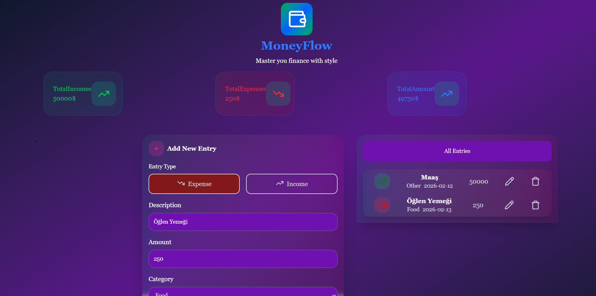

# 💰 Expense Tracker

Kullanıcıların gelir ve giderlerini takip edebildiği, harcamalarını kategorilere göre görüntüleyebildiği bir web uygulaması.

Bu proje, frontend geliştirme becerilerimi pekiştirmek ve gerçek hayat senaryosu üzerinde pratik yapmak amacıyla geliştirilmiştir.

---

## 🛠️ Kullanılan Teknolojiler

- React
- TypeScript
- Redux Toolkit
- Local Storage
- Tailwind 

---

## ✨ Özellikler

- ➕ Gelir / gider ekleme
- 🗂️ Kategori bazlı harcama takibi
- 📊 Toplam bakiye hesaplama
- 🧮 Dinamik veri güncelleme
- 💾 Local Storage ile veri saklama
- 📱 Responsive tasarım

---

## 📸 Ekran Görüntüleri



---

## ⚙️ Kurulum ve Çalıştırma

```bash
# Repoyu klonla
git clone https://github.com/serkanoztas/expense-tracker.git

# Proje klasörüne gir
cd expense-tracker

# Bağımlılıkları yükle
npm install

# Projeyi çalıştır
npm start
